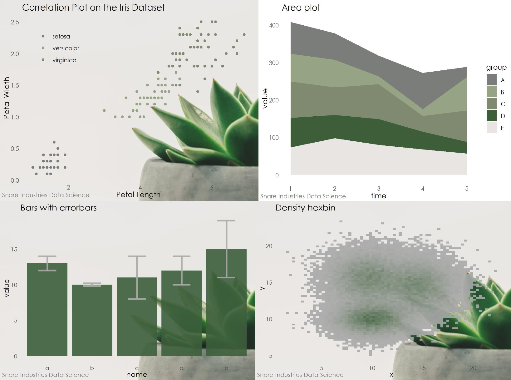

## snareplot

This repo contains the functions of the `snareplot` package, which once installed locally, provides helpful functions for creating and exporting  graphics made in ggplot2 in the style used by the fictional Snare Industries Data Science team.

## Using the functions

The package has four functions for plots: `theme_snare()`, `scale_colour_snare()`, `scale_fill_snare()`, and `finalise_plot()`.

Examples of how to use the package can be find in my Medium article, [Business Intelligence as a Data Scientist: Part 2](www.medium.com).

